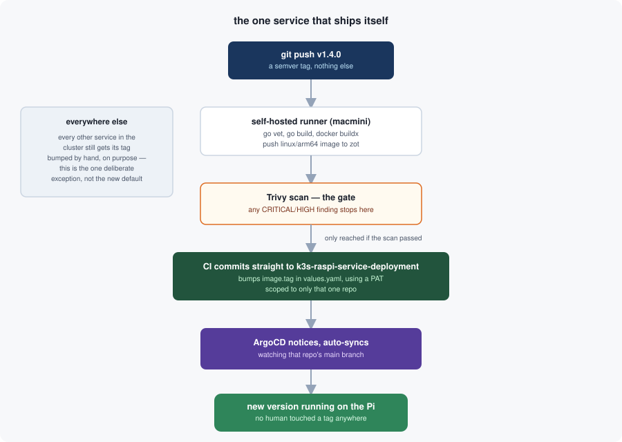

I already told the story of getting [an IP-address tool]() running on my cluster — four DNS layers, one certificate surprise, a happy ending. What I skipped over is the app itself: `get-public-ip`, a single Go file that does exactly one thing. It's small enough to read end to end in a couple of minutes, and almost every line in it exists because of a decision I had to think hard about, not because Go made me write it that way.

## What it actually does

Hit it, get your public IP back — as a webpage, as `/raw` plain text, or as `/json`. That's the entire feature set. No database, no accounts, no dependencies beyond the Go standard library. If a service can be reduced to "read one header, write it back out," this is that service.

The interesting part isn't the feature. It's the one decision the whole thing hinges on: *which* header do you believe?

## Reading the wrong header would defeat the entire point

There are two candidates for "the client's IP," and HTTP hands you both: `X-Forwarded-For` and, since this cluster sits behind Cloudflare, `CF-Connecting-IP`. Most tutorials reach for `X-Forwarded-For` out of habit. This service deliberately never reads it.

The reason is topology, not paranoia. Every request that reaches this app has already passed through a Cloudflare tunnel — there's no public IP on the origin for anyone to hit directly, and no other path in. On that topology, `X-Forwarded-For` is the more commonly spoofed header: it's a chain of client-suppliable strings, and I have no origin-side way to tell "the real client appended this" from "someone typed this in Postman." `CF-Connecting-IP`, by contrast, is set exclusively by Cloudflare's edge — a client can send whatever value they like in that header too, but Cloudflare overwrites it before the request ever reaches my tunnel. Trusting the wrong one wouldn't just be a bug; it would let anyone report any IP they wanted, which defeats the entire reason this tool exists.

```go
func resolveClientIP(r *http.Request) (ip net.IP, isIPv4 bool, ok bool) {
	cf := r.Header.Get("CF-Connecting-IP")
	if cf == "" {
		return nil, false, false
	}
	parsed := net.ParseIP(cf)
	if parsed == nil {
		return nil, false, false
	}
	if v4 := parsed.To4(); v4 != nil {
		return v4, true, true
	}
	return parsed, false, true
}
```

One header, checked once, no fallback to `RemoteAddr` either — on this topology `RemoteAddr` is always the Gateway's own in-cluster pod, never the real caller, so falling back to it would be actively misleading rather than merely imprecise. If `CF-Connecting-IP` is missing or unparseable, the honest answer is "I don't know," not a guess.

## IPv6 is a fallback, not a preference

I built this expecting to always report an IPv4 address, then found a wrinkle I hadn't anticipated: this hostname's DNS record is proxied through Cloudflare, which means Cloudflare auto-advertises an AAAA record right alongside the A. "IPv6 Compatibility" can only be turned off zone-wide, and only on an Enterprise plan — not an option here. So any client whose OS or ISP prefers IPv6 (common enough on mobile networks) connects to Cloudflare over IPv6, and `CF-Connecting-IP` shows up as an IPv6 address. There is no IPv4 address to recover in that case — it was never part of the connection.

The honest options were: fail outright, silently mislabel an IPv6 address as if it were IPv4, or report it correctly labeled. `resolveClientIP` returns the address family alongside the IP for exactly this reason, and both `/json` and the HTML page show "Your Public IPv6 Address" when that's what actually happened. Nothing here is hidden from the caller — it's just not the common case.

## The one service that deploys itself

The code is deliberately boring. The release pipeline is where I let myself do something I wouldn't do for anything with more blast radius: push a semver tag, and everything downstream happens without me touching another repo.



Push `vX.Y.Z`, and a self-hosted runner — has to be self-hosted, since it needs LAN access to my unauthenticated internal registry — vets, builds, and pushes a `linux/arm64` image. A Trivy scan gates on any CRITICAL or HIGH finding before anything else happens. Only past that gate does CI check out `k3s-raspi-service-deployment` with a fine-grained PAT scoped to just that one repo, sed-replace the image tag in its `values.yaml`, and push straight to that repo's `main`. ArgoCD, already watching that branch with auto-sync on, takes it from there.

Every other service in this cluster gets its tag bumped by hand — a deliberate default, so a human always looks at a diff before anything ships. This service is the one exception, and it's an exception on purpose: it's the lowest-stakes thing running here, the one where "let CI push straight to the deployment repo" is worth trying precisely because getting it wrong costs nothing but a redeploy.

## What I'd actually reuse

Not the app — nobody needs a second IP-address tool. What's reusable is the shape of the decisions: trust the header your edge provider guarantees, not the one a client can forge; when the "expected" case doesn't hold (no IPv4 to give), say so instead of faking it; and reserve full self-service deployment for the one thing where being wrong is genuinely cheap. None of that is specific to Go, or to Kubernetes, or to Cloudflare — it's just what "small and honest" looks like when you actually write it down.
