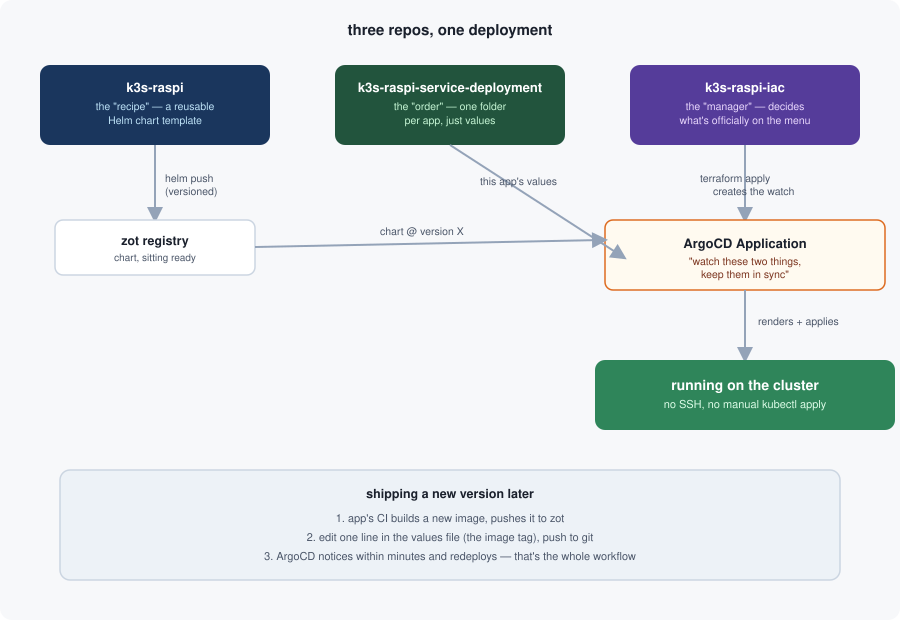

In [Part 1]() I put together all the plumbing: a front door, an encrypted internal network, a private app store, real certificates, a way in from the internet. What I didn't have yet was a way to actually *run my own apps* on it without SSH-ing in and typing commands by hand every time. This post is about fixing that.

## The problem with doing it by hand

Manually running commands works fine for a cluster with one app on it. It stops working the moment you want a second app, or the moment you rebuild the cluster from scratch and have to remember every step you did last time. What I actually wanted was: I push code to Git, and a few minutes later it's just... running. No SSH, no typing the same `kubectl` incantation from memory.

That idea has a name: GitOps. Instead of you pushing changes *into* the cluster, something inside the cluster constantly watches a Git repository and pulls changes *out* of it, applying whatever it finds. I use a tool called ArgoCD for this — think of it as a very patient robot that checks your recipe book every few minutes and quietly re-cooks whatever changed.

## Splitting the recipe from the order

Here's the part I went back and forth on the most: how much should live in *one* repository versus split across several? I ended up with three, each with one job:

- **The cluster itself** — the actual Raspberry Pi setup, the front doors, the bodyguard, all the pieces from Part 1. This one almost never changes once it's stable.
- **A recipe template** — a reusable Helm chart that says "here's the shape of a well-behaved app on this cluster": a namespace, a deployment, a route through the front door, sensible security defaults. It gets published once to my private app store, versioned, and then just... sits there, ready to be used.
- **The actual orders** — a separate repository, one folder per app, where each folder just says "use the recipe at version X, with these specific values" (which container image, which version, which web address). This is the *only* thing that changes when I ship a new version of an app.

The nice side effect of this split: the person writing the recipe (cluster conventions) almost never needs to touch the person placing an order (a specific app's config), and vice versa. Even though right now that person is just me wearing two hats, it's a habit worth having.

Laid out, the whole flow looks like this:



## Who's allowed to watch what

ArgoCD needs to be told, explicitly, "watch this folder in that repository, and keep it in sync with the cluster." Rather than typing that command by hand once and forgetting how I set it up, I used Terraform to declare it — the same way you'd declare any other piece of infrastructure. Adding a new app now means: write its order (the values file), add a few lines to Terraform describing what to watch, push to Git. ArgoCD notices within minutes and the app appears.

No SSH. No manual `kubectl apply`. Just a git push.

## What "the order" actually looks like

For people curious what one of those app-specific folders actually contains — it's genuinely just this small. This is the entire file that tells the cluster to run `get-public-ip`:

```yaml
image:
  repository: zot.homelab.icipicip.com/get-public-ip
  tag: v3.0.1

containerPort: 8080

gateway:
  external: true
  hostname: ip.icipicip.com
```

Six meaningful lines. Which image, which version, which port, which door, which address. Everything else — the namespace, the security defaults, the encrypted mesh membership — comes for free from the recipe (the Helm chart) this file is filling in.

And the piece that ties a recipe and an order together into something ArgoCD actually watches is just as small, declared once in Terraform:

```hcl
module "get_public_ip" {
  source = "../modules/argocd-application"

  name                   = "get-public-ip"
  destination_namespace  = "get-public-ip"
  chart_name             = "service-template"
  chart_version          = "0.1.2"
  values_path            = "get-public-ip"
}
```

That's the entire "menu entry." Everything from here on is ArgoCD's problem, not mine.

## In theory, this is beautiful

And it is! Right up until you actually try it for the first time, on a real app, with a real registry, a real domain name, and a real corner of the internet involved. I did exactly that with a tiny "what's my IP address" tool — about as simple an app as exists — and it still took four separate bugs and one genuine surprise before it actually worked.

That whole chaotic story is Part 3.
