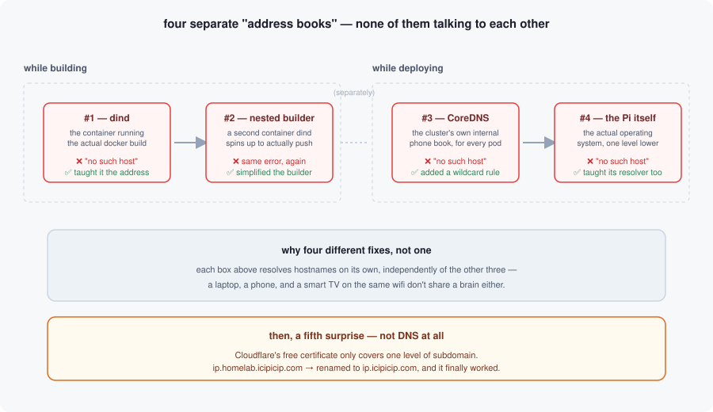

Parts [1]() and [2]() were the theory: a cluster, a robot that deploys things for me, a tidy three-repo system. This post is what happened when I actually pointed that whole machine at a real app for the first time.

The app itself could not have been simpler: a small tool that tells you your own public IP address. No database, no dependencies, a single file of code. If anything was going to deploy cleanly on the first try, it was this.

It did not deploy cleanly on the first try.

## Round one: the build can't find the shelf

Step one was building the app into a container image and pushing it to my private app store. It failed immediately: *"no such host."* The machine doing the build simply had no idea where my app store lived on the network — nobody had ever told it.

Fair enough. I taught it. Ran the build again.

*"No such host."* Same error. Word for word.

Turns out the piece doing the actual pushing wasn't the machine I'd just fixed — it was a second, temporary helper container spun up *inside* the first one, with its own separate idea of how to find things on the network. I'd fixed the outer shell and completely missed the one actually doing the work.

## Round two: the cluster can't find its own store, either

With that sorted, the image finally pushed. Small victory. Then I asked the cluster to actually deploy it, and the deployment tool failed trying to fetch that same app store — *"no such host,"* again, but from a completely different part of the system this time: the cluster's own internal address book. It turns out a cluster keeps its own private phone book for everything running inside it, separate from anything on your home network, and nobody had added this new entry there either.

Fixed that. One layer left, except I didn't know it yet.

## Round three: the Raspberry Pi itself doesn't know

The deployment ran again. The actual container still couldn't be pulled — *"no such host,"* a fourth time, now from the Raspberry Pi itself. Not the cluster software running on it. The Pi's own operating system, at the lowest level, keeping its own separate address book for anything it needs to fetch directly.

Four layers. Four separate address books. Each one legitimately unaware of the other three. In hindsight it makes sense — a laptop, a phone, and a smart TV on the same wifi don't share a brain either — but living through it in real time felt like a very slow game of whack-a-mole.



For anyone curious what one of those fixes actually looked like: my favorite is round two, the cluster's own internal address book. Rather than adding one entry and waiting to need a second one later for the next app, I taught it a wildcard rule instead — anything under my home domain resolves the same way, forever, automatically:

```
homelab.icipicip.com:53 {
    template IN A homelab.icipicip.com {
        match "^.*\.homelab\.icipicip\.com\.$"
        answer "{{ .Name }} 60 IN A 192.168.1.240"
    }
    forward . /etc/resolv.conf
}
```

Everything that isn't my home domain still falls through to the normal internet DNS on the last line — this rule only ever answers for the one address pattern it's meant to.

## And then, a plot twist

With all four fixed, the app finally ran. I opened it in a browser to see my public IP looking back at me, and instead got a blunt TLS error — the kind that means "we couldn't even agree on how to have a secure conversation," not "your certificate looks wrong."

This one wasn't a repeat of the DNS saga — it was something new. Cloudflare, which sits in front of anything I expose to the public internet, hands out free certificates automatically. What I hadn't known: the free version only covers a domain and *one* level of subdomain underneath it. I'd used two. One rename later — dropping to a flatter address — and it worked, cleanly, first try.

## What actually stuck with me

None of these four DNS failures were the same bug wearing a disguise. They were four genuinely different systems, each with its own reasonable-sounding assumption about how the network worked, and none of them talking to each other. The fix every time was the same discipline: don't guess which layer is broken, go prove it, one level at a time, before touching anything.

The tiny IP-address tool is live now, humming along on a Raspberry Pi on a shelf in my house. Which, considering where this started, feels like it earned its uptime.
